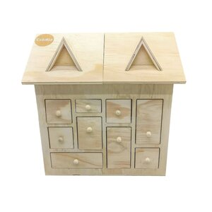
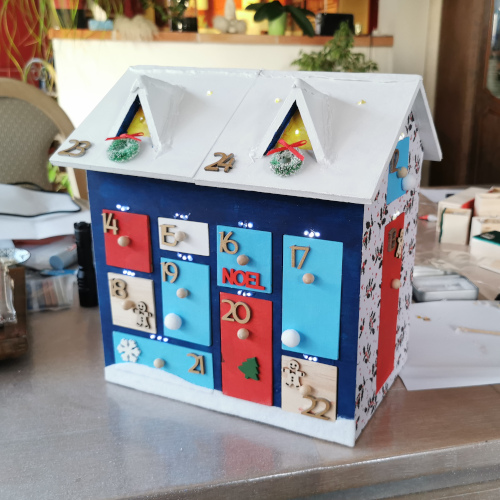

# DIY Smart Advent Calendar House 🎄

> [!WARNING]  
> This project is a work in progress. While it can serve as inspiration, it is not ready for plug-and-play use and requires additional development and customization.

<div align="center">
  
  
</div>

A fun, interactive advent calendar looking like a miniature wooden house with a drawer for each day leading up to Christmas. This project combines craftsmanship with electronics to create a delightful experience for children and grown-ups!

## Project Highlights

- **Interactive LEDs**: Each day, a specific LED lights up to guide the child to the correct drawer.
- **Drawer Detection**: Detects when a drawer is opened using Hall-effect sensors and magnets.
- **Audio Playback**: Plays music, stories, or sounds depending on opened drawer, also giving feedback when wrong drawer is opened.
- **Light Show**: Features decorative light displays synchronized with sound playback. (🚧 Planned feature)

---

## Folder Structure

- **`Fritzing`**: Contains the initial schematics created with the Fritzing software.
- **`KiCAD`**: Detailed electronic schematics and PCB designs created with KiCAD.
- **`Firmware`**: A PlatformIO project featuring the ESP32 firmware (work in progress).
- **`Documentation`**: Includes relevant datasheets and schema exports.
- **`Design`**: Includes decoration ideas, paint tests, and images of the house design.

---

## Hardware Overview

### Electronics Used
1. **ESP32-WROOM**: The main microcontroller also used for USB 5V power supply.
2. **TLC5947 Module**: 24-channel PWM driver for controlling the LEDs above each drawer, From Adafruit.
3. **2x PCF8575 IO Expanders**: To read the state of the 24 drawers via Hall-effect sensors (12 IOs each, each expander can handle up to 16 IOs).
4. **MAX98357 I2C Amplifier**: For better audio output compared to the PAM8403 module. (🚧 Realised on-board, schematics to change yet.)
5. **SPI SD Card Reader**: To store music, sound effects, or stories. Could also host update files (OTA), parameters, ...
6. **Hall-effect Sensors (A3144)**: Each drawer gets a small 10x10x1 mm *neodymium* magnet *(ferrite would be too weak)* and Hall-effect sensor to detect openings. `A3144` was selected, but requires improvement due to its active-low nature ("magnet present = on" ⇒ current is drawn almost all the time). Should select a non-latching active-high sensor instead.

---

## Tools Used

- **Fritzing**: Initial circuit layout and basic design.
- **KiCAD**: Advanced schematics and PCB design for production-ready boards.
- **PlatformIO**: Development environment for writing Arduino-based firmware for the ESP32.

---

## Getting Started

### Prerequisites
- Install [PlatformIO](https://platformio.org/) to compile and upload firmware.
- Required dependencies for the ESP32 firmware can be installed using:
  ```bash
  pio pkg install
  ```

### Hardware Assembly
1. **Electronics Integration**:
   - Connect ESP32, LEDs, sensors, and audio modules as per the schematics in the `KiCAD` folder.
   - Solder the components onto the PCB designed in `KiCAD` or use a breadboard for prototyping.

2. **House Assembly**:
   - Paint and decorate the wooden house using ideas from the `Design` folder.
   - Attach the LEDs above each drawer and install Hall-effect sensors inside.

3. **Calibration**:
   - Test the sensor detection and calibrate the thresholds for drawer opening/closing.
   - Load the firmware onto the ESP32 to test the LED control and audio playback.

## Future Enhancements

- Add Wi-Fi capabilities for remote control (🚧 ongoing).
- Integrate a mobile/web app.
- Explore active-high Hall-effect sensors for smoother drawer state detection.

## License

Feel free to reuse components of this project, **subject to their respective licenses**. Please note that third-party components (such as Fritzing and KiCAD parts) may have their own licensing terms, which you should review accordingly. (⚠️ TODO: Check the licenses for each part).

### My Original Work:

Released under [CC0 1.0 Universal (Public Domain Dedication)](https://creativecommons.org/publicdomain/zero/1.0/). This means you can use *my* artwork and *my* code for any purpose without any restrictions.

In short, you are free to use, modify, and distribute both the code and artwork with very few limitations.
